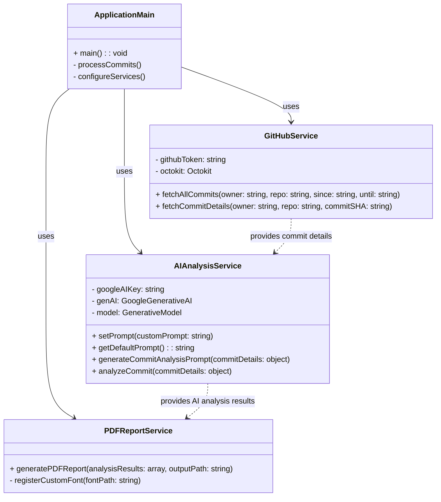

# Service Relationship Diagram

```mermaid
classDiagram
    class GitHubService {
        - githubToken: string
        - octokit: Octokit
        + fetchAllCommits(owner: string, repo: string, since: string, until: string)
        + fetchCommitDetails(owner: string, repo: string, commitSHA: string)
    }

    class AIAnalysisService {
        - googleAIKey: string
        - genAI: GoogleGenerativeAI
        - model: GenerativeModel
        + setPrompt(customPrompt: string)
        + getDefaultPrompt(): string
        + generateCommitAnalysisPrompt(commitDetails: object)
        + analyzeCommit(commitDetails: object)
    }

    class PDFReportService {
        + generatePDFReport(analysisResults: array, outputPath: string)
        - registerCustomFont(fontPath: string)
    }

    class ApplicationMain {
        + main(): void
        - processCommits()
        - configureServices()
    }

    ApplicationMain --> GitHubService: uses
    ApplicationMain --> AIAnalysisService: uses
    ApplicationMain --> PDFReportService: uses
    
    GitHubService ..> AIAnalysisService: provides commit details
    AIAnalysisService ..> PDFReportService: provides AI analysis results
```