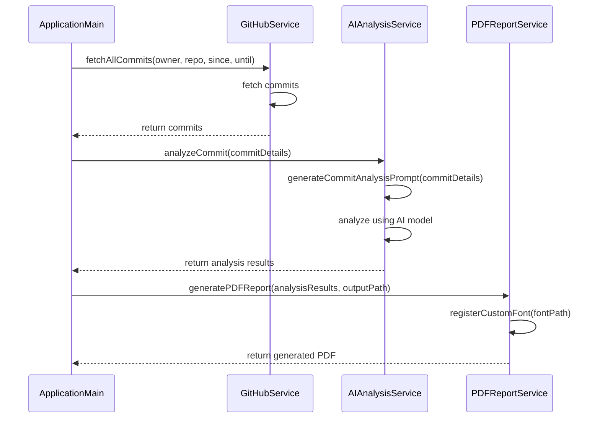

# sequenceDiagram

```mermaid
sequenceDiagram
    participant ApplicationMain
    participant GitHubService
    participant AIAnalysisService
    participant PDFReportService

    ApplicationMain->>GitHubService: fetchAllCommits(owner, repo, since, until)
    GitHubService->>GitHubService: fetch commits
    GitHubService-->>ApplicationMain: return commits

    ApplicationMain->>AIAnalysisService: analyzeCommit(commitDetails)
    AIAnalysisService->>AIAnalysisService: generateCommitAnalysisPrompt(commitDetails)
    AIAnalysisService->>AIAnalysisService: analyze using AI model
    AIAnalysisService-->>ApplicationMain: return analysis results

    ApplicationMain->>PDFReportService: generatePDFReport(analysisResults, outputPath)
    PDFReportService->>PDFReportService: registerCustomFont(fontPath)
    PDFReportService-->>ApplicationMain: return generated PDF

```